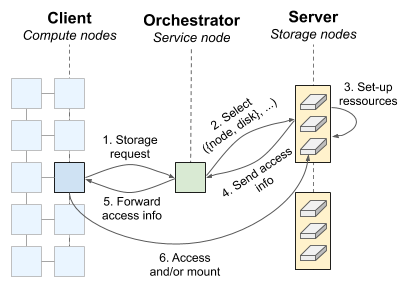

# Storalloc - A Scheduler for Storage Resources

Storalloc is a prototype of a job scheduler for storage
resources. While compute resources are usually allocatable exclusively
on a HPC system, storage resources are still either a global and
shared file system or distributed intermediate resources difficult to
effectively use. We propose here a proof-of-concept of a scheduler
based on a three-component design (client, orchestrator, server) for
allocating storage space the same way we allocate compute resources on
a supercomputer. Storalloc can also run locally in a simulation mode
for testing scheduling algorithms or playing traces (Darshan support
in progress). Our prototype can now support NVMeoF technology to attach
storage resources through a high-speed network.

## Design



## Requirements

Storalloc uses the [ZeroMQ]{https://zeromq.org/} messaging library to implement the communication layer between components. ZeroMQ is an active open source project (LGPL) that offers an advanced communication API built on top of sockets. The Python bindings and the library can be easily installed on most systems through the package manager (`python3-zmq` on Debian for instance) or via `pip`.

A few other Python libraries are necessary for Storalloc to run such as `yaml`.

## Simulation mode

Storalloc can run in simulation mode though the `--simulate` argument for clients and servers. That means that no actual storage space is allocated. As the network details of each component can be configured, it is even possible to run Storalloc on a single node (localhost). Below is a simple example of Storalloc executed on a local machine. The orchestrator is started first. Then a server registers to it. Finally, a client submit a request for 200GB during one hour. The three commands below are run in different terminals:

``` shell
$ ./orchestrator.py -c config/orchestrator/config.yml -v
```

``` shell
$ ./server.py -c config/server/config.yml -s config/server/systems/ault14.yml --simulate -v
```
``` shell
$ ./client.py -c config/client/config.yml -s 200 -t 60 -v
```

The different outputs (note the `-v` option for more verbosity) are as follows:

**Orchestrator**

``` shell
$ ./orchestrator.py -c config/orchestrator/config.yml -v
[D] Server registered. New resources available.
[D] [00000] New incoming request: [200 GB, 60 m]
[D] Access bandwidth for disk 0 (node 0, 8000 GB): 2.93 GBps
[D] Access bandwidth for disk 1 (node 0, 8000 GB): 2.93 GBps
[D] Access bandwidth for disk 2 (node 0, 8000 GB): 2.93 GBps
[D] Access bandwidth for disk 3 (node 0, 8000 GB): 2.93 GBps
[D] Access bandwidth for disk 4 (node 0, 8000 GB): 2.93 GBps
[D] Access bandwidth for disk 5 (node 0, 8000 GB): 2.93 GBps
[D] Access bandwidth for disk 6 (node 0, 8000 GB): 2.93 GBps
[D] Access bandwidth for disk 7 (node 0, 8000 GB): 2.93 GBps
[D] Access bandwidth for box 0: 12.50 GBps
[D] [00000] Add [200 GB, 60 m] on node 0, disk 0
┌───┬────────────
│  0│□□□□□□□□□□□□
├---┼------------
│  1│
├---┼------------
│  2│
├---┼------------
│  3│
├---┼------------
│  4│
├---┼------------
│  5│
├---┼------------
│  6│
├---┼------------
│  7│
└───┴────────────
```

**Server**

``` shell
$ ./server.py -c config/server/config.yml -s config/server/systems/ault14.yml --simulate -v
[D] Registering to the orchestrator (tcp://127.0.0.1:35001)
storalloc: {'job_id': 0, 'disk': 0, 'capacity': 200, 'duration': 60}
```

**Client**

``` shell
$ ./client.py -c config/client/config.yml -s 200 -t 60 -v
[D] Submitting request [200,60]
storalloc: Pending job allocation 0
storalloc: job 0 queued and waiting for resources
storalloc: Granted job allocation 0
storalloc: {'job_id': 0, 'type': 'nvme', 'nqn': 'nqn.2014-08.com.vendor:nvme:nvm-subsystem-sn-d78432'}
```
