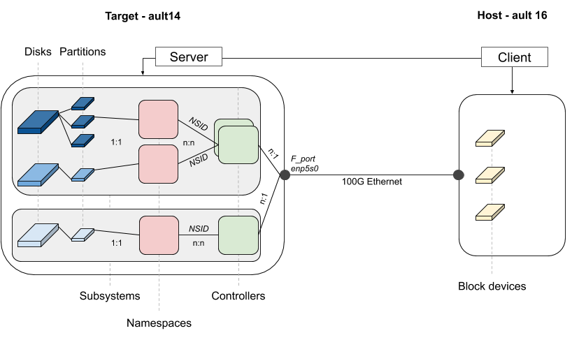

# Storalloc - A Scheduler for Storage Resources

Storalloc is a prototype of a job scheduler for storage resources. While compute resources are usually allocatable exclusively on a HPC system, storage resources are still either a global and shared file system or distributed intermediate resources difficult to effectively use. We propose here a proof-of-concept of a scheduler based on a client-server model for allocating storage space the same way we allocate compute resources on a supercomputer. In particuler, this proof of concept supports NVMeoF technology to attach storage resources through a high-speed network.

## Requirements

  * MLNX_OFED Driver
  * nvmetcli (requires `python-setuptools` and `python-configshell-fb`)

## NVMeoF Architecture Overview at CSCS



## Target (ault14)

A tool developed by Intel, called `nvmetcli`, offers a useful interactive approach for target configuration. In order to prepare the disks and the partitions before exporting the storage resources, a few steps are required. First of all, let's connect to the storage box and load the requried kernel module.

``` shell
$ ssh ault
$ ssh ault14
$ sudo modprobe nvmet
```

### Disk Partitioning

As an exemple, we will create a 512MB partition on the first NVMe disk:

``` shell
$ sudo sudo fdisk -l /dev/nvme0n1 
Disk /dev/nvme0n1: 7.3 TiB, 8001563222016 bytes, 15628053168 sectors
Units: sectors of 1 * 512 = 512 bytes
Sector size (logical/physical): 512 bytes / 512 bytes
I/O size (minimum/optimal): 512 bytes / 512 bytes

$ sudo fdisk /dev/nvme0n1
Welcome to fdisk (util-linux 2.31.1).
Changes will remain in memory only, until you decide to write them.
Be careful before using the write command.

The old xfs signature will be removed by a write command.

Device does not contain a recognized partition table.
The size of this disk is 7.3 TiB (8001563222016 bytes). DOS partition table format cannot be used on drives for volumes larger than 2199023255040 bytes for 512-byte sectors. Use GUID partition table format (GPT).

Created a new DOS disklabel with disk identifier 0xa1578da8.

Command (m for help): g
Created a new GPT disklabel (GUID: C48809C1-D0CC-8747-9B9C-71050162D856).
The old xfs signature will be removed by a write command.

Command (m for help): p

Disk /dev/nvme0n1: 7.3 TiB, 8001563222016 bytes, 15628053168 sectors
Units: sectors of 1 * 512 = 512 bytes
Sector size (logical/physical): 512 bytes / 512 bytes
I/O size (minimum/optimal): 512 bytes / 512 bytes
Disklabel type: gpt
Disk identifier: C48809C1-D0CC-8747-9B9C-71050162D856

Command (m for help): n
Partition number (1-128, default 1): 
First sector (2048-15628053134, default 2048): 
Last sector, +sectors or +size{K,M,G,T,P} (2048-15628053134, default 15628053134): 1050624

Created a new partition 1 of type 'Linux filesystem' and of size 512 MiB.

Command (m for help): p
Disk /dev/nvme0n1: 7.3 TiB, 8001563222016 bytes, 15628053168 sectors
Units: sectors of 1 * 512 = 512 bytes
Sector size (logical/physical): 512 bytes / 512 bytes
I/O size (minimum/optimal): 512 bytes / 512 bytes
Disklabel type: gpt
Disk identifier: C48809C1-D0CC-8747-9B9C-71050162D856

Device         Start     End Sectors  Size Type
/dev/nvme0n1p1  2048 1050624 1048577  512M Linux filesystem

// For computing the offset: first_sector + size_in_bytes (*1024) / sector_size (512)
```

### NVMeoF configuration

Then, through the `nvmetcli` command, we can configure this partition and export it so it can be mounted locally by a remote node.

``` shell
cd ~/NVMeoF/nvmetcli
sudo ./nvmetcli

// Then follow https://github.com/JunxiongGuan/nvmetcli/blob/master/Documentation/nvmetcli.txt
```

Before deleting a subsystem, it is preferable to first disconnect the block devices from the hosts (see next Section). Then, following this order, the ports and the subsystems can be deleted on the Target node thanks to the `delete` command of `nvmetcli`.

To totally clear the NVMe Target configuration (remove subsystems, namespaces and ports):

``` shell
sudo nvmetcli clear
```

## Client (ault16)

As for the target node, some kernel modules have to be loaded on the client side as well.

``` shell
$ ssh ault
$ salloc -N1 --res=nvme --exclusive -t 04:00:00
$ ssh ault16
$ sudo modprobe nvme_rdma nvme_fabrics
```

### NVMe Subsystem

A component called "Discovery Controller" can be queried from a host or the target itself to discover the different subsystems available. From a host, it is necessary to know the IP address and the port of the target (usually, this latter is 4420):

``` shell
ftessier@ault16 ─> sudo nvme discover -a 148.187.104.85 -t rdma -s 4420

Discovery Log Number of Records 1, Generation counter 4
=====Discovery Log Entry 0======
trtype:  rdma
adrfam:  ipv4
subtype: nvme subsystem
treq:    not specified, sq flow control disable supported
portid:  1
trsvcid: 4420
subnqn:  nqn.2014-08.org.nvmexpress:NVMf:uuid:9db415d9-7cac-4d1c-bbbd-a45b54838530
traddr:  148.187.104.85
rdma_prtype: not specified
rdma_qptype: connected
rdma_cms:    rdma-cm
rdma_pkey: 0x0000
```

### Controller

According the the [NVMe specifications](https://nvmexpress.org/wp-content/uploads/NVM-Express-1_4-2019.06.10-Ratified.pdf) (page 274), a controller is the interface between a host and an NVM subsystem. There are three types of controller:

  * I/O controller: access to logical block data and metadata of the subsystem's disks
  * Admin controller: management capabilities
  * Discovery controller: used in NVMeoF to provide access to Discovery Log Page

To list the controller of each NVMe disk available on the system:

``` shell
for disk in `sudo nvme list | grep nvme | cut -d' ' -f1`; do echo -n "$disk : "; sudo nvme list-ctrl $disk; done;
```

### Namespaces

[TBC]

### Connect a remote block device

``` shell
$ sudo nvme connect -a 148.187.104.85 -t rdma -s 4420 -n nqn.2014-08.org.nvmexpress:NVMf:uuid:9db415d9-7cac-4d1c-bbbd-a45b54838530
$ lsblk

NAME        MAJ:MIN RM   SIZE RO TYPE MOUNTPOINT
nvme0n1     259:0    0 931.5G  0 disk 
├─nvme0n1p1 259:1    0   512M  0 part /boot/efi
└─nvme0n1p2 259:2    0   931G  0 part /
nvme1n1     259:3    0   512M  0 disk 
```
### Disconnect a remote block device

``` shell
sudo nvme disconnect -n nqn.2014-08.org.nvmexpress:NVMf:uuid:9db415d9-7cac-4d1c-bbbd-a45b54838530
```

## General remarks

### NVMe devices

To list the locally available NVMe devices:

``` shell
sudo nvme list
```

## Benchmarks

### Read and write bandwidth

FIO job files are available in the `benchmarks` directory. To evaluate read and write performance, a disk has to be connected (but not mounted) and the benchmark ran as follows:

``` shell
sudo fio <job_file>
```

### Latency

``` shell
ioping -c 50 /dev/nvme1n1

[...]
4 KiB <<< /dev/nvme0n1 (block device 931.5 GiB): request=47 time=81.4 us
4 KiB <<< /dev/nvme0n1 (block device 931.5 GiB): request=48 time=71.2 us
4 KiB <<< /dev/nvme0n1 (block device 931.5 GiB): request=49 time=56.5 us (fast)
4 KiB <<< /dev/nvme0n1 (block device 931.5 GiB): request=50 time=87.1 us
[...]
--- /dev/nvme0n1 (block device 931.5 GiB) ioping statistics ---
49 requests completed in 3.45 ms, 196 KiB read, 14.2 k iops, 55.4 MiB/s
generated 50 requests in 49.0 s, 200 KiB, 1 iops, 4.08 KiB/s
min/avg/max/mdev = 52.7 us / 70.5 us / 214.1 us / 28.4 us
```

## Bibliography

### NVMeoF

* [NVMeoF Specifications](https://nvmexpress.org/specifications/)
* Various talks about NVMe and NVMeoF
  * [Under the Hood with NVMe over Fabrics](https://www.snia.org/sites/default/files/ESF/NVMe_Under_Hood_12_15_Final2.pdf)
  * [An NVM Express Tutorial](https://www.flashmemorysummit.com/English/Collaterals/Proceedings/2013/20130812_PreConfD_Marks.pdf)
* Blog posts by Jérôme Tissière
  * [NVMe, NVMe over Fabrics and RDMA for network engineers](https://aboutnetworks.net/nvme-and-nvmeof/)
  * [https://aboutnetworks.net/rocev2-on-nexus9k/](https://aboutnetworks.net/rocev2-on-nexus9k/)
* nvme-cli tool - NVM-Express user space tooling for Linux (different from nvmetcli!)
  * [Git repo of nvme-cli](https://github.com/linux-nvme/nvme-cli)
* nvmetcli tool - Configure NVMe-over-Fabrics Target
  * [Git repo of nvmetcli](https://github.com/JunxiongGuan/nvmetcli)
  * [Man page](https://www.mankier.com/8/nvmetcli)
* Configuration
  * [NVM Express over Fabrics using Intel Ethernet Connection X722 iWARP RDMA - Configuration guide](https://www.intel.com/content/dam/www/public/us/en/documents/guides/nvme-over-fabrics-x722-iwarp-rdma-configuration-guide.pdf)
  * [HowTo Configure NVMe over Fabrics](https://community.mellanox.com/s/article/howto-configure-nvme-over-fabrics)

